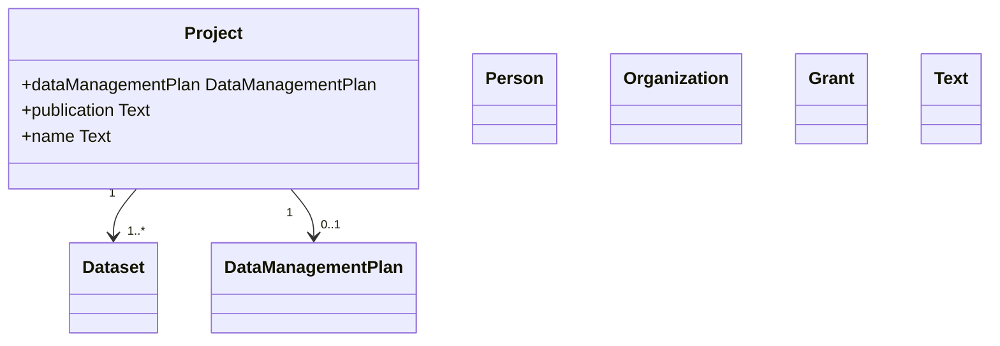

# Metadata

## Domain Entities

```mermaid
classDiagram
  Project "1" --> "1..*" Dataset
  Project "1" --> "0..1" DataManagementPlan

  class Project {
    +dataManagementPlan DataManagementPlan
    +publication Text
    +name Text
  }
  
  class Dataset {

  }

  class Person {

  }

  class Organization {

  }

  class Grant {

  }

  class DataManagementPlan {

  }

  class Text {
    %%+contents Map[string]string
  }

```

## API representation

