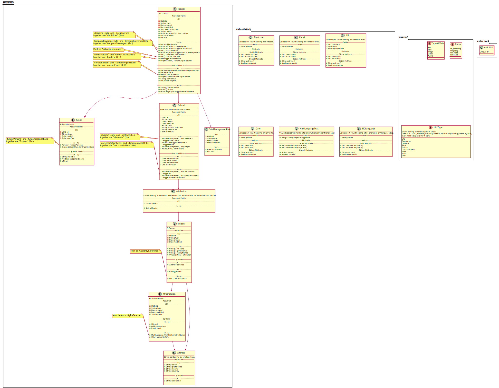

# Metadata

## Domain Entities



## API representation

A metadata set can be serialized to json. This json data must conform to the [json-schema](schema-metadata.json).  
The following example illustrates how the json might look:

  
(Cf. `example.json` too.)

The json representation is "flat", i.e. not nested, so all top-level types are present in the first level of depth of the json document tree. All those objects have a unique `@id` property. Wherever this object is referenced further down in the document, this is done so by this ID.  
(NB: json schema does not allow for consistency checks of internal references, so the existence of an object with a given ID can not be guaranteed by json validation.)

### Macro structure

The overall structure of the json representation of a metadata-set should look like this:

```json
{
  "$schema": "...",
  "project": {
    ...
  },
  "datasets": [
    ...
  ],
  "persons": [
    ...
  ],
  "organizations": [
    ...
  ],
  "grants": [
    ...
  ],
  "dataManagementPlan": {
    ...
  }
}
```

As only datasets can occur that are part of the project (or vice versa: the project must contain all datasets), this connection is always assumed and not linked explicitly.

`project` and `datasets` are required, `persons`, `organizations` and `grants` are optional.

### project

...

### dataset

...

## Open Questions:

- [ ] how to handle URLs? separate type? or just value object? what info do we need for a URL?
- [ ] in domain entities, do we need references between datasets and project? or is this redundant?

## notes:

- how does ValueObject work? how do we know, what type the value is?
- use generic to indicate type of value object?
- rename sameAs
- ensure to have sameAs-equivalent everywhere
