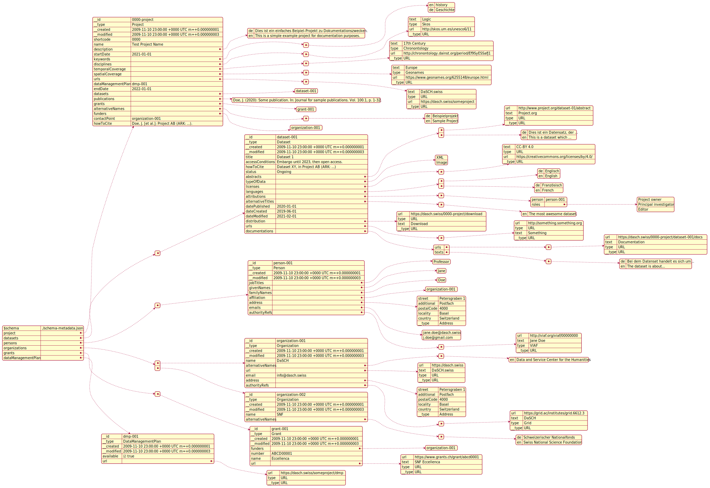

# Metadata

## Domain Entities


## API representation

A metadata set can be serialized to json. This json data must conform to the [json-schema](schema-metadata.json).  
The following example illustrates how the json might look:



The json representation is "flat", i.e. not nested, except in cases where there is a clear one-to-one relationship. Namely, if an object can only occur once and can not be referenced anywhere else.

### Macro structure

The overall structure of the json representation of a metadata-set should look like this:

```json
{
  "$schema": "...",
  "project": {
    ...
  },
  "datasets": [
    ...
  ],
  "persons": [
    ...
  ],
  "organizations": [
    ...
  ],
  "grants": [
    ...
  ]
}
```

As only datasets can occur that are part of the project (or vice versa: the project must contain all datasets), this connection is always assumed and not linked explicitly.

`project` and `datasets` are required, `persons`, `organizations` and `grants` are optional.

### project

...

### dataset

...

## Open Questions:

- [ ] how to handle URLs? separate type? or just value object? what info do we need for a URL?
- [ ] in domain entities, do we need references between datasets and project? or is this redundant?

## notes:

- how does ValueObject work? how do we know, what type the value is?
- use generic to indicate type of value object?
- change alternate to alternative
- dataset.alternativeTitle should be array of multilanguagetext
- rename sameAs
- ensure to have sameAs-equivalent everywhere
